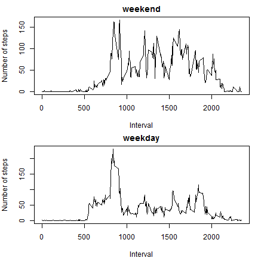

# Reproducible Research: Project 1 - Report

## Loading and preprocessing the data
First, we load the data, which is in the .csv format, and we turn the interval
column of the data set into a factor. 

```r
dat <- read.csv('activity.csv')
dat$interval <- as.factor(dat$interval)
```


## What is mean total number of steps taken per day?
The total number of steps per day is calculated by taking 
the sum of the steps column in the dataset for each level of the date factor.

```r
# Remove NAs before calling sum through tapply
allsums <- tapply(dat$steps[!is.na(dat$steps)],
                  dat$date[!is.na(dat$steps)],
                  sum)
# Plot the histogram
hist(allsums,breaks=10,col='green',main='',
     xlab='Total number of steps per day')
```

 

```r
# Calculate the mean and median, ignoring NAs
stepsmean <- mean(allsums,na.rm=TRUE)
stepsmed <- median(allsums,na.rm=TRUE)
```
The mean total number of steps per day is 1.0766189 &times; 10<sup>4</sup> and the median total
number of steps per day is 10765. 

## What is the average daily activity pattern?
To determine the average daily activity pattern, we have to average the number 
of steps taken in every 5-minute interval over all days.

```r
# Remove NAs before calling mean through tapply
interval.avgsteps <- tapply(dat$steps[!is.na(dat$steps)],
                            dat$interval[!is.na(dat$steps)],
                            mean)
# Extract the intervals as integers
interval <- as.integer(levels(dat$interval))
# Plot the time series of number of steps per interval averaged over all days
plot(interval,interval.avgsteps,
     type='l',xlab='Interval',ylab='Number of steps')
```

 

```r
# Determine the interval with the highest number of steps across all days
interval.maxsteps <- interval[interval.avgsteps==max(interval.avgsteps)]
```
The 5-minute interval that contains the largest number of steps averaged across
all days is the 835 interval.

## Imputing missing values
First, we determine the amount of NA values in the steps column of the data set.
There are no NA values in the other columns.

```r
# Determine which rows contain NAs
na.booleans <- is.na(dat$steps)
# Calculate the total amount of NAs
na.amount <- sum(na.booleans)
```
There are 2304 missing values in the data set, out of a total of 
17568 entries. 

To ensure no bias is introduced by the missing values, we replace a missing 
value in a given 5-minute interval with the average amount of steps across all 
days for that interval. Missing values always occur for one entire day, so 
the amount of consecutive missing values is always the same and equal to the 
amount of intervals in each day.


```r
# Replace NAs with values from interval.avgsteps. The latter is recycled.
steps_repl <- replace(dat$steps,na.booleans,interval.avgsteps)
# Create a new data.frame containing the replaced NAs and the two original date
# and interval columns
dat_repl <- cbind(steps_repl,dat[,2:3])
# Calculate the sums for every day
allsums_repl <- tapply(dat_repl$steps,dat_repl$date,sum)
# Plot the histogram
hist(allsums_repl,breaks=10,col='green',main='',
     xlab='Total number of steps per day [Missing values replaced]')
```

 

```r
# Calculate the mean and median, ignoring NAs
stepsmean_repl <- mean(allsums_repl)
stepsmed_repl <- median(allsums_repl)
```
The mean total number of steps per day is 1.0766189 &times; 10<sup>4</sup> and the median 
total number of steps per day is 1.0766189 &times; 10<sup>4</sup>. Replacing the missing values
with averages across all days per 5-minute interval did not affect the mean or
median of the number of steps per day. 

Imputing missing data this way makes the distribution of total number of steps 
per day a lot narrower, i.e. the standard deviation decreases. It reduces the 
noise in the data set. This makes sense because we have only added averages to 
the distribution, which - in the case of a Gaussian distribution - are centered
around the mean $\mu$. 

## Are there differences in activity patterns between weekdays and weekends?
To determine if there are any differences in activity patterns between weekdays
and weekends, we first have to create a new factor that differs between the two
day types. Then we can follow the approach from above where we calculate the 
number of steps per 5-minute interval averaged over either all weekdays or all 
weekends.

```r
# Make sure the used language is English
Sys.setlocale('LC_TIME',"English")
```

```
## [1] "English_United States.1252"
```

```r
# Convert the date strings to class Date
dat_repl$date <- as.Date(dat_repl$date)
# Determine whether a given day is in the weekend
weekend.boolean <- weekdays(dat_repl$date) %in% c("Saturday","Sunday")
# Introduce a new column naming the day either 'weekend' or 'weekday'
dat_repl$daytype <- as.factor(ifelse(weekend.boolean,
                                     "weekend","weekday"))
# Apply the mean function based on two factors 
interval.avgsteps_repl <- tapply(dat_repl$steps,
                                 list(dat_repl$interval,dat_repl$daytype),
                                 mean)
# Make the plot
par(mfrow = c(2, 1),mar = c(4, 4, 2, 1))
# The weekends are in column 2
plot(interval,interval.avgsteps_repl[,2],
     type='l',xlab='Interval',ylab='Number of steps',main='weekend')
# The weekdays are in column 1
plot(interval,interval.avgsteps_repl[,1],
     type='l',xlab='Interval',ylab='Number of steps',main='weekday')
```

 
  
There seems to be some difference between weekdays and weekends. During the 
weekend, the maximum average number of steps is lower. The average
number of steps throughout most of the weekends is slightly higher than
throughout the weekdays. On weekdays, the step count is higher for the early 
intervals of the day, and lower for the late intervals of day. There seems to be
more variation throughout the day on weekends than on weekdays.

Further statistical analysis is needed to determine the significance of these 
differences.
